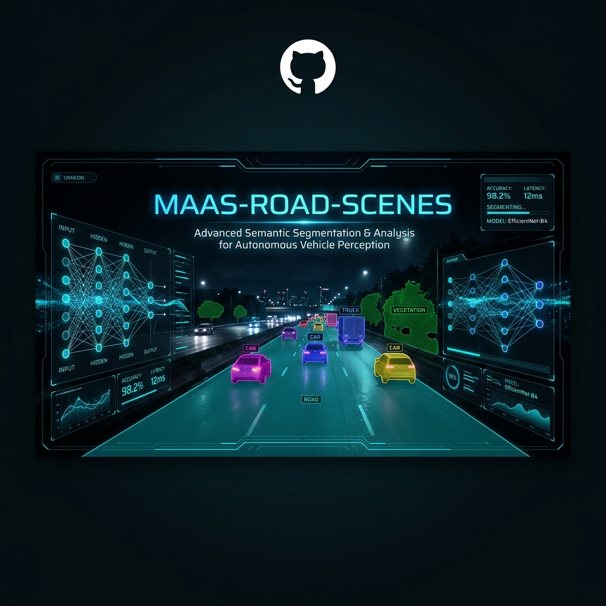

<div align="center">
  

  # MAAS-Road-Scenes
  
  **Multi-Armed Adversarial Selection for Road Scene Anomaly Detection**

  [](https://www.python.org/downloads/)
  [](https://pytorch.org/)
  [](https://opensource.org/licenses/MIT)

  ---
</div>

## Overview

**MAAS-Road-Scenes** is a comprehensive evaluation pipeline designed for robust semantic segmentation and anomaly detection in road environments. It integrates state-of-the-art models like **ERFNet** and **EoMT** (Encoder-only Mask Transformer) to evaluate their performance across diverse out-of-distribution (OOD) datasets.

The project focuses on automated benchmarking, temperature scaling analysis, and modular evaluation across multiple datasets, providing a unified interface for researchers to assess model reliability in safety-critical autonomous driving scenarios.

## Key Features

- **Multi-Model Support**: Native integration of **ERFNet** and **EoMT**.
- **Automated Pipeline**: End-to-end evaluation from inference to results table generation.
- **Temperature Scaling**: Integrated tools for OOD detection calibration via temperature scaling.
- **Extensive Datasets**: Pre-configured support for Cityscapes, Fishyscapes, RoadAnomaly, and more.
- **Markdown Reporting**: Automatic generation of summary tables in `results/`.

---

## Project Structure

```text
MAAS-Road-Scenes/
├── assets/             # Project media and banner
├── config/             # YAML configuration files
├── core/               # Core logic and pipeline scripts
│   ├── evaluation/     # Main evaluation suite (run_pipeline.py)
│   └── utility/        # Shared utilities (logger, config loader)
├── Datasets/           # Symbolic links or data folders (Cityscapes, etc.)
├── results/            # Automatically generated performance tables
├── third_party/        # Integrated researchers' codebases (ERFNet, EoMT)
└── checkpoints/        # Model weights and checkpoints
```

---

##  Getting Started

### 1. Prerequisites

This project uses **two distinct virtual environments** to manage dependencies between different model implementations (ERFNet and EoMT).

### 2. Installation

```bash
# Clone the repository
git clone https://github.com/itsPinguiz/MAAS-Road-Scenes.git
cd MAAS-Road-Scenes

# Setup Virtual Environments (Example using venv)
# 1. Environment for general evaluation (ERFNet)
python -m venv core/evaluation/eval/.venv_eval
source core/evaluation/eval/.venv_eval/bin/python -m pip install -r core/evaluation/eval/requirements.txt

# 2. Environment for EoMT
python -m venv core/evaluation/eomt/.venv_eomt
source core/evaluation/eomt/.venv_eomt/bin/python -m pip install -r core/evaluation/eomt/requirements.txt
```

### 3. Usage

To run the entire evaluation pipeline, simply execute the `run_pipeline.py` script. This will orchestrate the full suite of tests across all configured models and datasets.

```bash
python core/evaluation/run_pipeline.py
```

Results will be saved as formatted tables in:
- `results/TABLE.md`: Main performance metrics.
- `results/TABLE_T.md`: Temperature scaling analysis.

---

##  Fine-Grained Analysis

We provide an advanced suite of analysis tools to evaluate models beyond global metrics. These scripts use pre-saved logits (generated by `evalAnomaly.py` when using `--save_logits`) to run granular performance breakdowns without requiring GPU inference.

### 1. Spatial & Semantic Boundary Analysis
Analyzes anomaly detection performance near semantic class borders versus homogeneous flat regions, as well as breaking down performance by distance/depth using horizontal image bands.
```bash
python core/analysis/eval_semantics.py \
    --logits_dir   core/evaluation/eval/saved_logits/erfnet/Fishyscapes_Static \
    --images_glob  "Datasets/Fishyscapes/fs_static/images/*.jpg" \
    --dataset_type fs_static \
    --model_name   ERFNet
```
*Outputs are saved to `results/analysis/semantics/`*

### 2. Object Typology Analysis
Finds connected components in the Ground Truth to evaluate performance specifically on small, medium, and large anomalies. It additionally maps in-distribution false positives to standard categories like "Things" vs. "Stuff".
```bash
python core/analysis/eval_objects.py \
    --logits_dir   core/evaluation/eval/saved_logits/erfnet/Fishyscapes_Static \
    --images_glob  "Datasets/Fishyscapes/fs_static/images/*.jpg" \
    --dataset_type fs_static \
    --model_name   ERFNet
```
*Outputs are saved to `results/analysis/objects/`*

### 3. Resolution & Attention Mechanisms
Measures the computation-accuracy trade-off by comparing inference resolutions to Frames Per Second (FPS). Additionally extracts the self-attention maps corresponding to anomaly tokens within Vision Transformers (e.g., EoMT / DINOv2) using PyTorch forward hooks.
```bash
core/evaluation/eomt/.venv_eomt/bin/python core/analysis/eval_resolution_attention.py \
    --images_glob  "Datasets/Fishyscapes/fs_static/images/*.jpg" \
    --dataset_type fs_static \
    --run_resolution_eval \
    --run_attention_eval
```
*Outputs are saved to `results/analysis/resolution_attention/`*

---

##  Credits & Citations

This project integrates and builds upon several incredible open-source contributions. We extend our gratitude to the authors of the following papers:

### **ERFNet**
> **Eduardo Romera, José M. Álvarez, Luis M. Bergasa, and Roberto Arroyo.**  
> *"ERFNet: Efficient Residual Factorized ConvNet for Real-Time Semantic Segmentation"*  
> IEEE Transactions on Intelligent Transportation Systems (T-ITS), 2017.

### **EoMT (Encoder-only Mask Transformer)**
> **Tommie Kerssies, Niccolò Cavagnero, Alexander Hermans, Narges Norouzi, Giuseppe Averta, Gijs Dubbelman, and Daan de Geus.**  
> *"Encoder-only Mask Transformer for Image Segmentation"*  
> CVPR 2024. [[Original Repo](https://github.com/tue-mps/eomt)]

---
